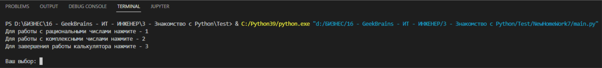
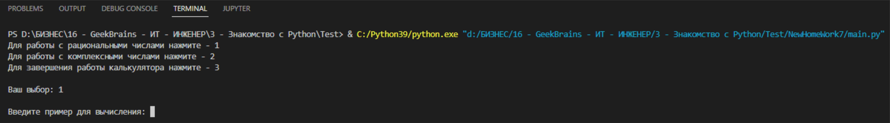
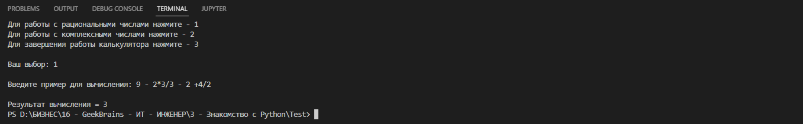
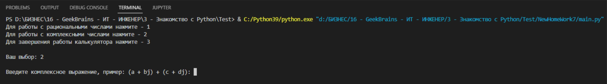
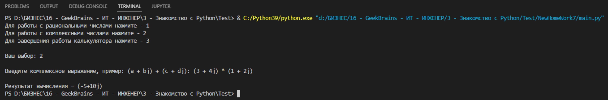
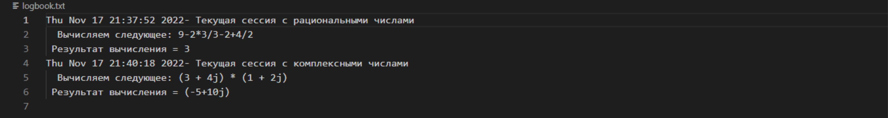

# Калькулятор версия 1.0
### Разработчик - Алексей Минасян

## Архитектура приложения:

__`main.py`__ - Главный исполняемый файл, точка входа. 
__`controller.py`__ - Выбор пользователем режима работы калькулятора, ввод самих операций, вывод результата
__`model.py`__ - Модуль вычислений
__`logs.py`__ - Модуль логирования: создание журнала операций и запись их в текстовый файл
__`logbook.txt`__ - Журнал операций

## Описание работы калькулятора:

Для начала работы с приложением, запустите файл `main.py`

У вас на экране появится следующее меню:
- Для работы с рациональными числами нажмите - 1
- Для работы с комплексными числами нажмите - 2
- Для завершения работы калькулятора нажмите - 3

- Ваш выбор: 

Для выбора пункта меню необходимо нажать соответствующую цифру на клавиатуре: 1, 2 или 3

## Режим работы с рациональными числами

Выбрав данный режим работы калькулятора, у вас на экране появится поле для ввода:

Введите пример для вычисления:

Здесь вы можете произвести следующие математические вычисления:
- сложение
- вычитание
- умножение
- деление

Также можете произвести вычисление математического выражения, например 9 - 2*3/3 - 2 + 4/2

## Режим работы с комплексными числами

Выбрав данный режим работы калькулятора, у вас на экране появится поле для ввода:

Введите комплексное выражение, пример: (a + bj) + (c + dj):

Здесь вы можете произвести следующие математические вычисления:
- сложение
- вычитание
- умножение
- деление

Историю всех операций вы можете посмотреть в журнале - `logbook.txt`:

Благодарим Вас за использование нашего программного продукта!